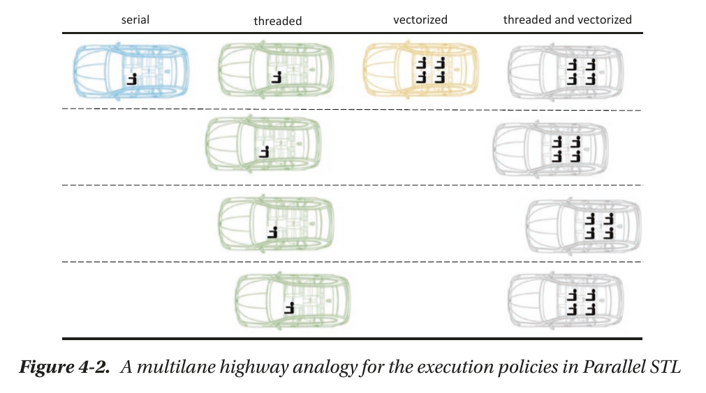
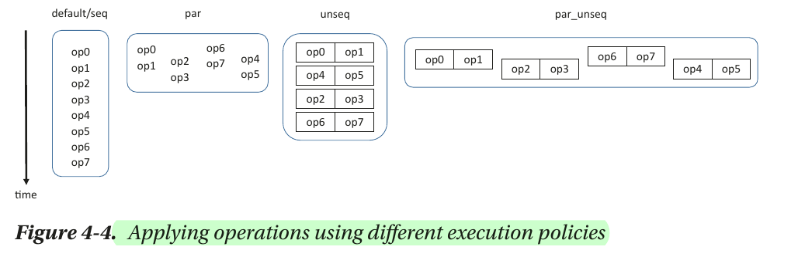
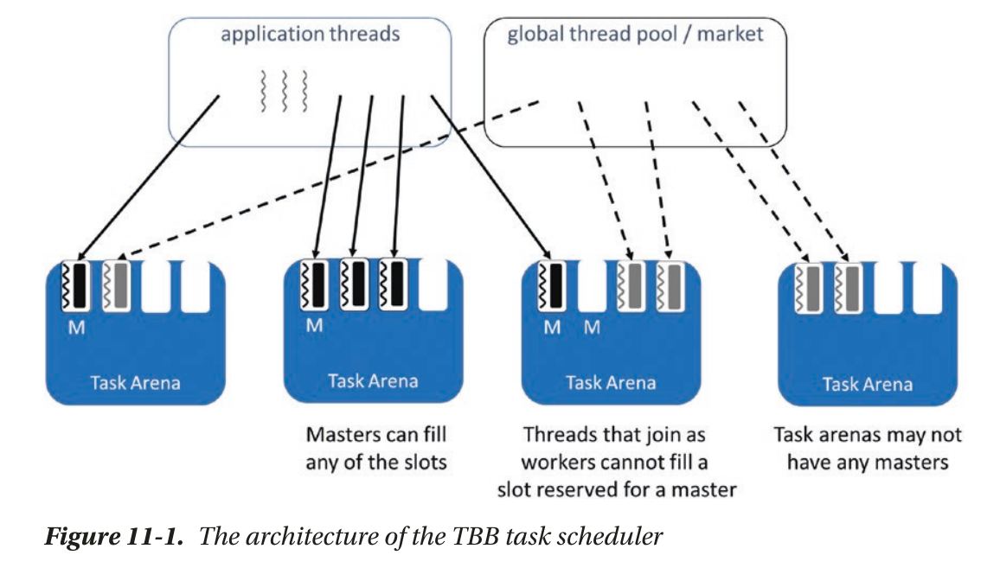
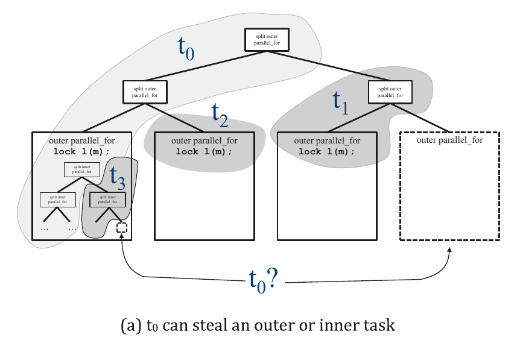
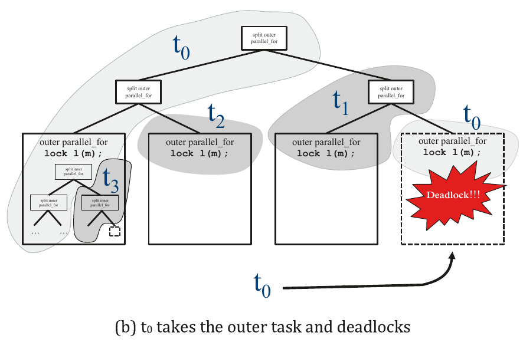

# Pro TBB 

❗❗❗ MAIN NOTES ARE HIGHLIGHTED IN BOOK ITSELF. THESE ARE ADDITIONAL NOTES.

## Preface 

### 🧠 Nested Parallelism: TBB vs. OpenMP

#### ✅ What is Nested Parallelism?
> **Nested parallelism** occurs when a parallel region spawns another parallel region inside it.

---

#### 🔄 TBB: Natural Nested Tasking

- **Work-Stealing Scheduler**  
  Efficiently balances nested tasks across threads without manual intervention.

- **Lightweight Tasks**  
  TBB tasks are much lighter than OS threads, making deep nesting scalable.

- **Composable Algorithms**  
  Nested parallel calls "just work"—you can parallelize in one function and call it from another that's also parallel.

- **Scales Gracefully**  
  No need to tune thread counts manually. TBB dynamically adapts to hardware and workload.

---

#### ⚠️ OpenMP: Limited Nesting Efficiency

- **Thread Oversubscription Risk**  
  Each nested parallel region may create a new thread team → leads to contention and slowdown.

- **Needs Manual Control**  
  Must enable nested parallelism with `omp_set_nested(1)` and configure thread limits.

- **Less Composability**  
  Nested parallel sections may require careful coordination and resource management.

- **Heavier Overhead**  
  Threads in OpenMP are typically OS threads—more costly to manage compared to TBB tasks.

---

#### 📊 Side-by-Side Comparison

| Feature                | **Intel TBB**                | **OpenMP**                     |
|------------------------|------------------------------|-------------------------------|
| Scheduling             | Dynamic work-stealing         | Static or user-defined        |
| Nested Region Support  | Native, composable            | Must enable manually          |
| Thread Management      | Lightweight tasks             | OS-level threads              |
| Load Balancing         | Automatic                     | Manual tuning needed          |
| Performance on Nested Tasks | Scales well               | May degrade                   |

---

#### 💡 Verdict
> If you're building modern, modular C++ apps with dynamic workloads, **TBB’s composable nested parallelism** makes it more powerful and flexible than OpenMP in complex scenarios.

### Amdahl’s Law vs Gustafson’s Law

| **Feature**               | **Amdahl’s Law**                                                                 | **Gustafson’s Law**                                                            |
|---------------------------|----------------------------------------------------------------------------------|--------------------------------------------------------------------------------|
| **Originator**            | Gene Amdahl (1967)                                                               | John L. Gustafson (1988)                                                       |
| **Focus**                 | Limits of speedup due to the serial portion of a task                            | Scalability of parallel systems with increasing problem size                   |
| **Assumption**            | Fixed problem size                                                               | Problem size scales with the number of processors                              |
| **Formula**               | `Speedup = 1 / [(1 - P) + (P / N)]`                                              | `Speedup = N - (1 - P) × (N - 1)`                                              |
| **Interpretation**        | Serial bottlenecks limit speedup, even with more processors                      | Efficient parallel performance with increased workload                         |
| **Viewpoint**             | Pessimistic about the benefits of parallelism                                    | Optimistic about system scalability                                            |
| **Use Case**              | Evaluating limits for existing workloads                                         | Designing scalable systems for larger workloads                                |
| **Limitation**            | Doesn’t scale problem size; ignores memory or communication overhead             | Assumes perfect scaling; may not reflect practical system limitations          |

### Locality of Reference

Accessing memory is costly the first time, but faster afterward due to caching. Like short-term memory, caches remember recent data. When loops access memory contiguously (good spatial locality) and reuse data soon (good temporal locality), performance improves.

In C/C++, arrays are stored in row-major order, so elements like C[i][2] and C[i][3] are adjacent in memory, while C[2][j] and C[3][j] are not.

❌ Poor Locality: Inefficient Loop Order

```cpp
for (int i = 0; i < N; ++i)
  for (int j = 0; j < N; ++j)
    for (int k = 0; k < N; ++k)
      C[i][j] += A[i][k] * B[k][j];  // Poor spatial locality for B
```

- Accesses B column-wise in a row-major system ⇒ cache misses.

✅ Improved Locality: Swapped Loop Order

```cpp
for (int i = 0; i < N; ++i)
  for (int k = 0; k < N; ++k)
    for (int j = 0; j < N; ++j)
      C[i][j] += A[i][k] * B[k][j];  // Better cache utilization
```

- Now both A and B are accessed more contiguously ⇒ better cache hits.

### Data ALignment vs Data Sharing vs False Sharing

| Feature               | Data Alignment                                                                 | Data Sharing                                                                                     | False Sharing                                                                                   |
|-----------------------|--------------------------------------------------------------------------------|---------------------------------------------------------------------------------------------------|--------------------------------------------------------------------------------------------------|
| **Definition**         | Arranging data in memory according to hardware alignment boundaries           | Allowing multiple processes or threads to access the same data                                   | Multiple threads access different variables that reside on the same cache line                  |
| **Goal**               | Improve memory access speed and enable vectorization                          | Enable collaboration and reduce data duplication                                                 | Often unintentional; leads to performance degradation                                           |
| **Performance Impact** | ✅ Positive: improves cache efficiency and SIMD performance                   | ⚖️ Neutral to positive: depends on synchronization and access pattern                            | ❌ Negative: increases memory latency due to cache line bouncing                                |
| **Typical Use Case**   | Structuring arrays/structs for SIMD operations                                | Shared memory in MPI/OpenMP, collaborative tasks                                                  | Multithreaded programs with adjacent variables accessed by separate threads                     |
| **Detection**          | Compiler warnings, profiling tools                                            | File system permissions or shared memory inspection                                               | Hardware counters (e.g. HITM events), Intel VTune, LIKWID                                       |
| **Mitigation**         | Use `__attribute__((aligned(N)))`, `memalign()` or compiler flags             | Apply appropriate access control mechanisms (ACLs, POSIX groups)                                 | Add padding, align variables to cache line size (e.g., 64 bytes), avoid shared writes           |
| **Example Scenario**   | Aligning `double` arrays to 64-byte boundaries for AVX-512                    | Users accessing shared simulation input files on an HPC cluster                                  | Two counters for different threads allocated on the same cache line                             |


### False sharing 

- Simple C++ example that demonstrates false sharing and how to fix it using padding to avoid multiple threads writing to the same cache line.

🚫 Example with False Sharing

```cpp
#include <iostream>
#include <thread>
#include <vector>

constexpr int NUM_THREADS = 4;
constexpr long NUM_ITER = 100000000;

struct SharedData {
    int counter[NUM_THREADS]; // All counters are adjacent in memory
};

void increment(SharedData* data, int index) {
    for (long i = 0; i < NUM_ITER; ++i) {
        data->counter[index]++;
    }
}

int main() {
    SharedData data{};
    std::vector<std::thread> threads;

    for (int i = 0; i < NUM_THREADS; ++i) {
        threads.emplace_back(increment, &data, i);
    }

    for (auto& t : threads) {
        t.join();
    }

    for (int i = 0; i < NUM_THREADS; ++i) {
        std::cout << "Counter[" << i << "] = " << data.counter[i] << "\n";
    }

    return 0;
}
```

In this version, all `counter[i]` values are likely to reside on the same cache line, causing false sharing when multiple threads update them simultaneously.

---

✅ Fixed Version with Padding

```cpp
#include <iostream>
#include <thread>
#include <vector>

constexpr int NUM_THREADS = 4;
constexpr long NUM_ITER = 100000000;
constexpr int CACHE_LINE_SIZE = 64;

struct alignas(CACHE_LINE_SIZE) PaddedCounter {
    int value;
    char padding[CACHE_LINE_SIZE - sizeof(int)];
};

struct SharedData {
    PaddedCounter counter[NUM_THREADS];
};

void increment(SharedData* data, int index) {
    for (long i = 0; i < NUM_ITER; ++i) {
        data->counter[index].value++;
    }
}

int main() {
    SharedData data{};
    std::vector<std::thread> threads;

    for (int i = 0; i < NUM_THREADS; ++i) {
        threads.emplace_back(increment, &data, i);
    }

    for (auto& t : threads) {
        t.join();
    }

    for (int i = 0; i < NUM_THREADS; ++i) {
        std::cout << "Counter[" << i << "] = " << data.counter[i].value << "\n";
    }

    return 0;
}
```

By aligning and padding each `counter` to a separate cache line, we eliminate false sharing and significantly improve performance in multithreaded environments.

### 🧠 Understanding the Power of Threads + Vectorization

Modern CPUs can do two big things to speed up programs:

#### 1. **Multithreading (using all CPU cores)**
- Imagine your processor has **32 cores**—like having 32 workers doing tasks at the same time.
- A library like **Intel TBB** can help your program use **all these cores together**.
- This could give you **up to 32× speedup**, if everything scales perfectly.

#### 2. **Vectorization (each core works faster)**
- Each core also has tools (like **AVX instructions**) to process **multiple numbers at once**.
- This is like one worker doing **4 things at once**.
- So even with just one core, you could get **up to 4× faster math**.

#### 🚀 Put Them Together: Multiplied Performance
- If you combine both techniques:
  - **32 cores** × **4 numbers at once** = **theoretically 256× faster** 💥
- That's why performance-focused developers use **both**: threads **and** vector instructions.

> It’s like giving each worker a power tool—and then hiring 31 more of them. ⚡🛠️

---

## Chapter 2 : Generic Parallel Algorithms

### The Generic Algorithms in the Threading Building Blocks library

| 🗂️ **Category**            | 🧩 **Generic Algorithm**         | 📝 **Brief Description**                                                                 | 🧪 **Syntax**                                                                 |
|---------------------------|----------------------------------|------------------------------------------------------------------------------------------|------------------------------------------------------------------------------|
| **Loop Parallelism**      | `parallel_for`                   | Executes loop iterations in parallel over a range.                                       | `parallel_for(range, body);`                                                 |
|                           | `parallel_reduce`                | Parallel loop with a reduction operation (e.g., sum).                                    | `parallel_reduce(range, identity, func, reduction);`                         |
|                           | `parallel_deterministic_reduce` | Like `parallel_reduce`, but ensures deterministic results regardless of thread count.    | `parallel_deterministic_reduce(range, identity, func, reduction);`          |
|                           | `parallel_scan`                  | Computes prefix sums (inclusive/exclusive scan).                                         | `parallel_scan(range, body);`                                                |
| **Function Invocation**   | `parallel_invoke`                | Executes multiple functions concurrently.                                                | `parallel_invoke(func1, func2, ..., funcN);`                                 |
| **Stream Processing**     | `parallel_do`                    | Processes a stream of tasks with dynamic work addition.                                  | `parallel_do(input_range, body);`                                            |
|                           | `parallel_for_each`              | Applies a function to each element in a range (parallel version of `std::for_each`).     | `parallel_for_each(begin, end, func);`                                       |
| **Sorting**               | `parallel_sort`                  | Sorts elements in parallel using comparison-based sorting.                               | `parallel_sort(begin, end);`                                                 |
| **Pipeline Processing**   | `pipeline`                       | Constructs a linear pipeline with custom serial or parallel filters.                     | `pipeline p; p.add_filter(...); p.run(token_count);`                         |
|                           | `parallel_pipeline`              | Higher-level composable pipeline using chained filter stages via operator `&`.           | `parallel_pipeline(token_count, stage1 & stage2 & ...);`                     |


### LAMBDA EXPRESSIONS –VS- USER-DEFINED CLASSES

#### ✅ Using Lambda Expression

```cpp
#include <tbb/parallel_for.h>
#include <vector>
#include <iostream>

int main() {
    std::vector<int> data(10, 0);

    tbb::parallel_for(0, static_cast<int>(data.size()), 1, 
        [&data](int i) {
            data[i] += 1;
        });

    for (int v : data) std::cout << v << " ";
    return 0;
}
```
#### 🧱 Using Functor (Function Object)

```cpp
#include <tbb/parallel_for.h>
#include <vector>
#include <iostream>

struct IncrementFunctor {
    std::vector<int>& data;

    IncrementFunctor(std::vector<int>& d) : data(d) {}

    void operator()(int i) const {
        data[i] += 1;
    }
};

int main() {
    std::vector<int> data(10, 0);

    tbb::parallel_for(0, static_cast<int>(data.size()), 1, IncrementFunctor(data));

    for (int v : data) std::cout << v << " ";
    return 0;
}
```

#### 📊 Summary: Lambda vs Functor in `tbb::parallel_for`

| Feature            | Lambda Expression                           | Functor                                       |
|--------------------|----------------------------------------------|-----------------------------------------------|
| **Syntax Style**   | Short, inline                                | Separate class with `operator()`              |
| **Use Case**       | Ideal for simple, local logic                | Better for reusable or complex logic          |
| **State Handling** | Captures external variables (by ref/value)   | Encapsulates internal state as members        |
| **Reusability**    | Limited to the scope it's defined in         | Can be reused across codebases and files      |
| **Readability**    | Very clean for small snippets                | More descriptive for structured operations     |
| **Testability**    | Harder to test in isolation                  | Easy to write unit tests for the functor      |


### Intel TBB Lazy initilization and warmup

- Intel oneTBB (Threading Building Blocks) lazily initializes its worker threads—meaning they’re only created when needed. This can cause a delay the first time you run a parallel algorithm.

- `warmupTBB()` below preemptively starts those threads so that subsequent parallel operations don’t suffer from that startup cost.

```cpp
void warmupTBB() {
  tbb::parallel_for(0, tbb::info::default_concurrency(), 
    [=](int) {
      tbb::tick_count t0 = tbb::tick_count::now();
      while ((tbb::tick_count::now() - t0).seconds() < 0.01);
    }
  );
}
```

🧠 `warmupTBB()` Function Explained

| 🔢 Line or Component                                 | 📝 Explanation |
|------------------------------------------------------|----------------|
| `static void warmupTBB()`                            | Defines a static helper function to warm up the TBB thread pool. |
| `tbb::parallel_for(...)`                             | Runs a loop in parallel across available threads. |
| `0, tbb::info::default_concurrency()`                | Loop from 0 to the number of hardware threads (cores). |
| `[=](int)`                                           | Lambda capturing all variables by value (loop index unused). |
| `tbb::tick_count t0 = tbb::tick_count::now();`       | Stores the current timestamp as a starting point. |
| `while ((now - t0).seconds() < 0.01);`               | Busy-waits for 10 milliseconds to keep the thread active. |


## Chapter 3 : Flow Graphs

### 🔗 Intel TBB `join_node` Types Explained

A `join_node` in Intel TBB's Flow Graph API synchronizes multiple inputs. It waits for messages on all its input ports, then combines them into a tuple and sends that tuple to the next node.

---

#### 🧩 Types of `join_node`

| Type            | Description                                                                 | Use Case                                  |
|-----------------|-----------------------------------------------------------------------------|-------------------------------------------|
| `queueing`      | Waits for one message on each port, in the order they arrive.               | Simple synchronization.                   |
| `reserving`     | Reserves messages until all inputs are available, then consumes them.       | Prevents message loss or premature use.   |
| `key_matching`  | Matches messages based on a shared key (e.g., ID).                          | When inputs must be matched by key.       |

---

#### 🧪 Examples

##### 1. `queueing` Join Node

```cpp
#include <tbb/flow_graph.h>
#include <iostream>

using namespace tbb::flow;

int main() {
    graph g;

    function_node<int> a(g, unlimited, [](int x) { return x; });
    function_node<float> b(g, unlimited, [](float y) { return y; });

    join_node<tuple<int, float>, queueing> j(g);

    function_node<tuple<int, float>> c(g, unlimited, [](const tuple<int, float>& t) {
        std::cout << "Got: " << get<0>(t) << " and " << get<1>(t) << std::endl;
    });

    make_edge(a, input_port<0>(j));
    make_edge(b, input_port<1>(j));
    make_edge(j, c);

    a.try_put(42);
    b.try_put(3.14f);
    g.wait_for_all();
}
```

🧠 __Explanation__: Waits for one int and one float, then sends the tuple to node c.

##### 2. `key_matching` Join Node

```cpp
join_node<tuple<int, float>, reserving> j(g);
```

🧠 __Explanation__: Reserves messages on each port and only removes them when all are available. Prevents consuming one input if the others aren’t ready.

##### 3. `reserving` Join Node

```cpp
#include <string>

struct Data {
    int key;
    std::string value;
};

auto key_func = [](const Data& d) { return d.key; };

join_node<tuple<Data, Data>, key_matching<int>> j(g, key_func, key_func);
```

🧠 __Explanation__ : Matches two Data objects with the same key. Useful when inputs arrive out of order but must be paired by ID.

#### ✅ Summary

- Use `queueing` for simple, ordered synchronization.

- Use `reserving` to avoid premature message consumption.

- Use `key_matching` when inputs must be matched by a shared key.

### 📊 Data Flow Graph vs Dependency Graph in Intel oneAPI (oneTBB)

This table compares the two primary graph paradigms in Intel oneAPI's Threading Building Blocks (TBB) Flow Graph API.

| Feature / Aspect              | **Data Flow Graph**                                                                 | **Dependency Graph**                                                                 |
|------------------------------|--------------------------------------------------------------------------------------|--------------------------------------------------------------------------------------|
| **Definition**               | A graph where **data values** are passed between nodes.                            | A graph where **task completion signals** (not data) are passed between nodes.       |
| **Message Type**             | Arbitrary data types (e.g., `int`, `std::string`, custom structs).                 | Always uses `continue_msg` to signal task completion.                                |
| **Node Types Used**          | `function_node`, `input_node`, `source_node`, `join_node`, etc.                    | Primarily `continue_node`, sometimes `broadcast_node`, `join_node`.                  |
| **Purpose**                  | Models **data-driven execution**: a node runs when it receives data.               | Models **control dependencies**: a node runs when all its predecessors complete.     |
| **Data Transfer**            | ✅ Yes — actual data is passed from node to node.                                   | ❌ No — only a signal (`continue_msg`) is passed; data is accessed via shared state. |
| **Execution Trigger**        | A node executes when it receives a message with data.                              | A node executes when it receives the required number of `continue_msg`s.             |
| **Use Case**                 | Streaming pipelines, transformations, filtering, etc.                              | Task orchestration, dependency resolution, barrier-like behavior.                    |
| **Example Node**             | `function_node<int>` receives and processes integers.                              | `continue_node` triggers execution after predecessors complete.                      |
| **Parallelism Granularity** | Fine-grained, task-per-message.                                                    | Coarser-grained, task-per-dependency.                                                |
| **Flexibility**              | High — supports complex data flows and transformations.                            | Simpler — focused on expressing execution order.                                     |
| **Example Scenario**         | Image processing pipeline: load → filter → compress.                              | Task A and B must finish before C starts.                                            |

---

#### 🧠 Summary

- Use a **Data Flow Graph** when your computation is **driven by data** and you want to pass values between stages.
- Use a **Dependency Graph** when your computation is **driven by task completion** and you just need to enforce execution order.

## Chapter 4 : TBB and the Parallel Algorithms of the C++ Standard Template Library

### Intel TBB and its relation to Standard C++ Parallel STL

#### 📚 Background

- C++17 introduced parallel versions of standard algorithms via the `<execution>` header.
- These algorithms accept execution policies like:
  - `std::execution::seq` – Sequential
  - `std::execution::par` – Parallel
  - `std::execution::par_unseq` – Parallel + Vectorized

- The C++ standard does **not mandate** how these are implemented.

#### 🛠️ Implementation Details

| Compiler / STL        | Uses TBB? | Notes                                                                 |
|------------------------|-----------|-----------------------------------------------------------------------|
| **GCC (libstdc++)**    | ✅ Yes     | Uses TBB if available. Required for `std::execution::par`.            |
| **Clang (libc++)**     | ❌ No      | Parallel STL support is limited or experimental.                      |
| **MSVC (Microsoft STL)** | ❌ No    | Uses its own internal thread pool. No TBB required.                   |

#### ✅ Do You Need TBB?

- **Using GCC?** → Yes, if you want to use `std::execution::par`, you need to install and link against **Intel TBB**.
- **Using MSVC?** → No, TBB is not required.
- **Using Clang?** → Support may be limited or require extra setup.


### A Parallel STL Execution Policy Analogy 





### Algorithms in Intel’s Parallel STL

[Intel Docs ](https://www.intel.com/content/www/us/en/developer/articles/guide/get-started-with-parallel-stl.html)


### TBB custom iterators 

1) 🔢 __tbb::counting_iterator__

This iterator generates a sequence of values on the fly—no container needed.

```cpp
#include <tbb/tbb.h>
#include <tbb/parallel_for.h>
#include <tbb/iterators/counting_iterator.h>
#include <iostream>

int main() {
    // Create a counting range from 0 to 10
    auto begin = tbb::counting_iterator<int>(0);
    auto end = tbb::counting_iterator<int>(10);

    // Parallel loop over the generated range
    tbb::parallel_for(begin, end, [](int i) {
        std::cout << "Index: " << i << "\n";
    });

    return 0;
}
```

🧠 Use case: When you need a virtual range of indices without allocating memory.

2) 🔗 __tbb::zip_iterator__

This lets you iterate over multiple containers in lockstep—like Python’s zip().

```cpp
#include <tbb/tbb.h>
#include <tbb/parallel_for.h>
#include <tbb/iterators/zip_iterator.h>
#include <vector>
#include <tuple>
#include <iostream>

int main() {
    std::vector<int> a = {1, 2, 3};
    std::vector<int> b = {10, 20, 30};

    auto zipped_begin = tbb::make_zip_iterator(a.begin(), b.begin());
    auto zipped_end = tbb::make_zip_iterator(a.end(), b.end());

    tbb::parallel_for(zipped_begin, zipped_end, [](auto zipped) {
        auto& [x, y] = zipped;
        std::cout << "Sum: " << (x + y) << "\n";
    });

    return 0;
}
```

🧠 Use case: When you want to process multiple containers in parallel without manual indexing.

3) 🔁 __tbb::transform_iterator__

This applies a transformation function on-the-fly during iteration.

```cpp
#include <tbb/tbb.h>
#include <tbb/parallel_for.h>
#include <tbb/iterators/transform_iterator.h>
#include <vector>
#include <iostream>

int main() {
    std::vector<int> data = {1, 2, 3, 4, 5};

    // Define a transformation: square each element
    auto square = [](int x) { return x * x; };

    auto begin = tbb::make_transform_iterator(data.begin(), square);
    auto end = tbb::make_transform_iterator(data.end(), square);

    tbb::parallel_for(begin, end, [](int val) {
        std::cout << "Squared: " << val << "\n";
    });

    return 0;
}
```

🧠 Use case: When you want to apply a function during iteration without modifying the original data.

### ⚙️ Intel TBB vs DPC++ — Side-by-Side Comparison

| Feature / Aspect              | **Intel TBB (oneTBB)**                                               | **DPC++ (Data Parallel C++)**                                                 |
|------------------------------|-----------------------------------------------------------------------|--------------------------------------------------------------------------------|
| **Programming Model**        | Task-based parallelism on CPU                                        | SYCL-based data-parallelism across CPU, GPU, FPGA                             |
| **Target Hardware**          | Multicore CPUs (Intel/AMD)                                           | Heterogeneous: CPUs, GPUs, FPGAs, and other accelerators                      |
| **Language Base**            | C++                                                                  | C++ with SYCL extensions (Khronos SYCL-based)                                 |
| **Execution Model**          | Shared-memory, fork-join task graph                                  | Offload model with command groups and device queues                           |
| **Parallel Constructs**      | `parallel_for`, `parallel_reduce`, `flow::graph`, etc.               | `parallel_for`, `parallel_reduce`, `buffer/accessor`, `nd_range`, etc.       |
| **Custom Iterators Support** | ✅ Yes, using STL-like iterators and utility adaptors                | ✅ Yes, e.g., `counting_iterator`, `zip_iterator`, `transform_iterator`       |
| **Accelerator Support**      | ❌ No                                                                 | ✅ Full support (e.g., Intel GPUs, FPGAs)                                      |
| **Memory Model**             | Shared memory                                                        | Unified Shared Memory (USM), buffer-accessor model                            |
| **Compiler**                 | Any standard C++ compiler (e.g., `g++`, `clang++`)                   | Requires `dpcpp` (from Intel oneAPI)                                          |
| **Use Case Focus**           | CPU-bound task parallelism, pipelines, flow graphs                   | Heterogeneous parallelism, GPU/accelerator offloading                         |
| **Learning Curve**           | Moderate (STL-like APIs)                                             | Steeper (SYCL, device/memory models)                                          |
| **STL Integration**          | Seamless with C++ STL                                                | Through oneDPL (DPC++ STL)                                                    |
| **Best For**                 | High-performance CPU task scheduling and fine-grained parallelism    | Accelerated computing and data-parallel workloads across devices              |

### Reading GCC/G++ Vectorization reports

- Reading vectorization reports in G++ is a great way to understand how well your loops are being optimized into SIMD instructions.

#### 🛠️ Step 1: Compile with Vectorization Reporting Flags

```sh
g++ -O3 -fopt-info-vec=vec.log your_code.cpp
```

- `O3`: Enables aggressive optimizations, including vectorization.
- `fopt-info-vec=vec.log`: Dumps vectorization info into vec.log.

👉 You can also use -fopt-info-vec-optimized, -fopt-info-vec-missed, or -fopt-info-vec-all for more control.


#### 📂 Step 2: Read the vec.log File

- Open vec.log and look for lines like:

```
your_code.cpp:10:13: optimized: loop vectorized using 16 byte vectors
your_code.cpp:20:5: missed: not vectorized: unsafe loop dependency
```

- optimized: The loop was successfully vectorized.
- missed: The compiler skipped vectorization—check the reason.
- note: Additional context or analysis.

#### Step 3: What to Look For


| What to Check                              | Why It Matters                                                                 |
|--------------------------------------------|---------------------------------------------------------------------------------|
| ✅ `"loop vectorized"`                     | Confirms SIMD was applied                                                      |
| ❌ `"not vectorized: unsafe dependency"`   | Indicates data dependencies blocked vectorization                              |
| ❌ `"function call in loop"`               | Function calls can prevent vectorization unless inlined or marked `constexpr` |
| ❌ `"unknown loop bound"`                  | Compiler needs clear loop bounds to vectorize safely                           |
| ✅ `"using 16/32/64 byte vectors"`         | Shows the SIMD width used (SSE, AVX, AVX-512, etc.)                             |


#### 🧠 Tips to Improve Vectorization

- Use simple, countable loops with known bounds.
- Avoid pointer aliasing (use restrict or references).
- Minimize function calls inside loops.
- Use aligned memory if possible.
- Prefer contiguous containers like std::vector.


- __NOTE__ :  Intel’s Parallel STL library uses OpenMP simd pragmas to support vectorization in a portable way for the
`unseq` and `parallel_unseq` policies.

## Chapter 5 : Synchronization: Why and How to Avoid It

### 🔒 Intel TBB Mutex Flavors Comparison

| **Mutex Type**             | **Scalable** | **Fair** | **Recursive** | **Reader-Writer** | **Wait Strategy** | **Best Use Case**                                      |
|---------------------------|--------------|----------|---------------|-------------------|-------------------|--------------------------------------------------------|
| `tbb::spin_mutex`         | ❌           | ❌       | ❌            | ❌                | Spin (yield)      | Very short critical sections with low contention       |
| `tbb::mutex`              | ❌           | ❌       | ❌            | ❌                | Block             | General-purpose, tolerates higher contention           |
| `tbb::queuing_mutex`      | ✅           | ✅       | ❌            | ❌                | Spin              | Fairness and scalability under high contention         |
| `tbb::recursive_mutex`    | ❌           | ❌       | ✅            | ❌                | Block             | When recursive locking is required                    |
| `tbb::spin_rw_mutex`      | ❌           | ❌       | ❌            | ✅                | Spin              | Many readers, few writers, short critical sections     |
| `tbb::queuing_rw_mutex`   | ✅           | ✅       | ❌            | ✅                | Spin              | Scalable reader-writer locking with fairness           |
| `tbb::speculative_spin_mutex` | ❌       | ❌       | ❌            | ❌                | Spin + HTM        | Hardware Transactional Memory (HTM) support available  |
| `tbb::speculative_spin_rw_mutex` | ❌    | ❌       | ❌            | ✅                | Spin + HTM        | HTM-enabled reader-writer locking                      |


- Spin = Fast but can burn CPU
- Yield = Shares CPU time better than spin, still active
- Block = Puts thread to sleep; lowest CPU use
- HTM = Speculative magic—runs optimistically, falls back if needed

### 🧠 What Is HTM?

__Hardware Transactional Memory__ is a CPU feature that lets you execute a block of code __as if it were atomic—meaning__, either __all of it runs successfully__, or __none of it does__.

Think of it like a "speculative lock":

>“I’ll run this code assuming no one else interferes. If someone does, I’ll roll back and try again.”

#### 🍪 Real-World Analogy

Imagine you're baking cookies in a shared kitchen:
  - You grab all the ingredients and start baking.
  - If no one else touches your stuff, you finish and leave.
  - But if someone grabs the flour mid-recipe, you throw everything away and start over.

That’s HTM: __optimistic concurrency__.

#### 🧪 Code Sketch (Intel TSX / HTM)

```cpp
#include <immintrin.h>  // For Intel TSX intrinsics
#include <iostream>

int main() {
    unsigned status = _xbegin();  // Start HTM transaction

    if (status == _XBEGIN_STARTED) {
        // Critical section (speculative)
        std::cout << "Inside HTM transaction\n";

        // Commit transaction
        _xend();
    } else {
        std::cout << "HTM transaction failed, fallback to lock\n";
        // Fallback: use mutex or retry
    }

    return 0;
}
```

#### 🧰 Can You Use HTM with g++?

✅ Yes, but with caveats:

##### ✅ HTM (Intel TSX) Requirements for g++

| **Requirement** | **Details** |
|-----------------|-------------|
| **CPU Support** | Must support Intel TSX (e.g., Haswell, Skylake) |
| **Compiler**    | `g++` supports HTM via Intel intrinsics in `<immintrin.h>` |
| **Flags**       | Compile with `-mrtm` to enable TSX instructions |
| **Example**     | `g++ -O2 -mrtm htm_example.cpp -o htm_test` |


> ⚠️ Not all CPUs or OSes enable TSX by default (some disable it due to errata).

#### 🧠 When to Use HTM?

- Fine-grained locking is too slow
- Low contention expected
- You want to avoid traditional mutex overhead

But HTM is __not a replacement__ for locks—it’s a speculative optimization.

### Mutex Internal Flow

- A thread wants to run but is blocked by a mutex → enters mutex __wait queue__.
- Once the mutex unlocks, it moves to scheduler __ready queue__.
- The __OS scheduler__ picks a thread from the ready queue.
- The __dispatcher__ loads its context and starts execution on a core.


### Mutex Flavors Examples

__🔒 1. tbb::mutex – General-purpose blocking mutex__

```cpp
tbb::mutex mtx;

void use_mutex(std::vector<int>& data) {
    tbb::mutex::scoped_lock lock(mtx); // Blocks if already locked
    data.push_back(1);
}
```
✅ Use when: You expect moderate contention and want the OS to block threads instead of spinning.


__🔁 2. tbb::recursive_mutex – Allows same thread to lock multiple times__

```cpp
tbb::recursive_mutex rec_mtx;

void recursive_lock(int depth) {
    if (depth == 0) return;
    tbb::recursive_mutex::scoped_lock lock(rec_mtx);
    std::cout << "Depth: " << depth << "\n";
    recursive_lock(depth - 1); // Safe: same thread can re-lock
}
```
✅ Use when: You need reentrant locking (e.g., recursive functions accessing shared state).


__🔄 3. tbb::spin_mutex – Lightweight, busy-waiting lock__

```cpp
tbb::spin_mutex spin_mtx;

void use_spin_mutex(std::vector<int>& data) {
    tbb::spin_mutex::scoped_lock lock(spin_mtx); // Spins until lock is free
    data.push_back(2);
}
```
✅ Use when: Critical section is very short and contention is low. ⚠️ Avoid under high contention—it wastes CPU cycles.


__📥 4. tbb::queuing_mutex – Fair and scalable under contention__

```cpp
tbb::queuing_mutex queue_mtx;

void use_queuing_mutex(std::vector<int>& data) {
    tbb::queuing_mutex::scoped_lock lock(queue_mtx); // FIFO fairness
    data.push_back(3);
}
```
✅ Use when: You want fairness and scalability under high contention.


__🧪 5. tbb::speculative_spin_mutex – HTM + spin fallback__

```cpp
tbb::speculative_spin_mutex spec_mtx;

void use_speculative_mutex(std::vector<int>& data) {
    tbb::speculative_spin_mutex::scoped_lock lock(spec_mtx);
    data.push_back(4);
}
```
✅ Use when: Your CPU supports Intel TSX (HTM). ⚠️ Fallbacks to spin if HTM fails or is unavailable.


__📚 6. tbb::spin_rw_mutex – Reader-writer lock with spin strategy__

```cpp
tbb::spin_rw_mutex rw_mtx;

void read_data(const std::vector<int>& data) {
    tbb::spin_rw_mutex::scoped_lock lock(rw_mtx, /* is writer */ false); // Shared (read) lock
    std::cout << "Read size: " << data.size() << "\n";
}

void write_data(std::vector<int>& data) {
    tbb::spin_rw_mutex::scoped_lock lock(rw_mtx, true); // Exclusive (write) lock
    data.push_back(5);
}
```
✅ Use when: Many readers, few writers. ⚠️ Writers block readers and vice versa.

### Problem with Locks : Deadlock and Convoying

#### 🛑 Deadlock: When Threads Hold Each Other Hostage

__Definition__: Deadlock occurs when two or more threads are blocked forever, each waiting for the other to release a resource.

__Common causes:__

- Circular wait conditions
- Nested resource locking
- Incorrect lock acquisition order
- Incorrect lock acquisition order

```cpp
// Both threads get stuck waiting for each other. 🔒
std::mutex A, B;

void thread1() {
    std::lock_guard<std::mutex> lockA(A);
    std::this_thread::sleep_for(std::chrono::milliseconds(100));
    std::lock_guard<std::mutex> lockB(B); // waits for B
}

void thread2() {
    std::lock_guard<std::mutex> lockB(B);
    std::this_thread::sleep_for(std::chrono::milliseconds(100));
    std::lock_guard<std::mutex> lockA(A); // waits for A
}
```

#### 🐢 Convoying: The Lock Hog That Slows Everyone Down

__Definition__: Convoying happens when a thread holding a lock gets descheduled (e.g., due to preemption), causing all other threads needing that lock to queue up and wait unnecessarily, reducing concurrency.

__Symptoms__:
- High contention
- Spikes in latency
- Poor scalability

__Example scenario:__
- One thread enters a critical section and is context-switched out.
- Other threads pile up waiting for that lock.
- Throughput drops because CPU cycles are wasted.

#### ⚖️ How Convoying Is Different from Deadlock

| **Aspect**       | **Deadlock**              | **Convoying**                        |
|------------------|---------------------------|--------------------------------------|
| **Threads stuck?** | Yes — indefinitely        | Not stuck — just delayed             |
| **Root cause**    | Circular resource waits   | Poor scheduling or lock strategy     |
| **Resolution**    | Needs design fix          | Can be improved with lock tuning     |

__🧩 Strategies to Fix or Avoid__

- Use `atomic` variable.
- Use `std::scoped_lock` or `std::lock()` to avoid deadlock via lock ordering
- Minimize critical section duration
- Prefer fine-grained locks or lock-free data structures
- Use backoff strategies (spin, yield, HTM`) to reduce convoying
- Profiling tools like VTune or perf can pinpoint hotspots related to both issues

### ⚙️ What Is CAS?

__CAS is an atomic instruction__ used to update a value only if it matches an expected value. It’s a fundamental building block for lock-free programming.

#### CAS Operation

It takes three arguments:
- Memory address (location of the variable)
- Expected value
- New value

If the current value at the memory address equals the expected value, it atomically swaps it with the new value. Otherwise, it does nothing.

#### 🧠 Under-the-Hood Implementation

__Hardware Level__

Modern CPUs (like x86, ARM) provide CAS via instructions like:
- CMPXCHG (x86)
- LDREX/STREX (ARM)

These are atomic and typically implemented using cache coherence protocols to ensure consistency across cores.

#### C++ Example

```cpp
#include <atomic>

std::atomic<int> value{0};

void tryUpdate() {
    int expected = 0;
    int desired = 42;
    if (value.compare_exchange_strong(expected, desired)) {
        // CAS succeeded: value is now 42
    } else {
        // CAS failed: someone else changed it
    }
}
```

#### 🧪 Example: Spinlock Using CAS

```cpp
std::atomic<bool> lockFlag{false};

void lock() {
    while (!lockFlag.compare_exchange_strong(false, true)) {
        // spin until lock is acquired
    }
}

void unlock() {
    lockFlag.store(false);
}
```

#### 🧵 CAS in Lock-Free Stack

```cpp
struct Node {
    int value;
    Node* next;
};

std::atomic<Node*> top{nullptr};

void push(int val) {
    Node* newNode = new Node{val};
    Node* oldTop;
    do {
        oldTop = top.load();
        newNode->next = oldTop;
    } while (!top.compare_exchange_weak(oldTop, newNode));
}
```

#### 🧩 CAS Caveats

- __ABA Problem__ : Value changes from A → B → A, CAS sees no change. Solutions include version tagging.
- __Spinning waste__: In high contention, threads may spin too long.
- __Limited to single-word updates__: Can’t atomically update multiple variables.

### ABA Problem 

#### 🐛 Where ABA Creeps In

Imagine this sequence:

1. __Thread 1__ reads `top = A` and prepares to pop it.

2. __Thread 1__ gets interrupted.

3. __Thread 2__ pops `A`, deletes it, pushes a new node B, then pushes a new node `A` (reusing the same memory address as original `A`).

4. __Thread 1__ resumes and sees `top == A` — same pointer, so CAS succeeds.

5. But now `A` is a __different object__ — possibly with different data or invalid memory.

This leads to __undefined behavior__, like accessing freed memory or corrupt data.

#### 🛡️ How to Fix It

##### ✅ Use Tagged Pointers or Version Counters

A tagged pointer combines:
 - A pointer to a node
 - A version number (tag)

This tag helps detect if the pointer was changed and then reverted — the classic __ABA__ scenario.

Instead of just comparing the pointer, we compare the __pointer + tag__ as a single atomic unit.

##### 🧪 C++ Example: Tagged Pointer in a Lock-Free Stack

Let’s define a simple structure:

```cpp
#include <atomic>
#include <cstdint>

struct Node {
    int value;
    Node* next;
};

// Combine pointer and tag into one atomic unit
struct TaggedPointer {
    Node* ptr;
    uint64_t tag;

    bool operator==(const TaggedPointer& other) const {
        return ptr == other.ptr && tag == other.tag;
    }
};

// Atomic wrapper
std::atomic<TaggedPointer> top;
```

##### 🔁 How CAS Works with TaggedPointer

```cpp
void push(Node* newNode) {
    TaggedPointer oldTop = top.load();
    TaggedPointer newTop;

    do {
        newNode->next = oldTop.ptr;
        newTop.ptr = newNode;
        newTop.tag = oldTop.tag + 1; // increment tag to reflect change
    } while (!top.compare_exchange_strong(oldTop, newTop));
}
```

__Breakdown:__

 - `oldTop` holds the current pointer and tag.
 - We prepare `newTop` with the new node and incremented tag.
 - CAS succeeds only if both pointer and tag match — preventing ABA.


### 🧵 True Sharing vs 🚨 False Sharing

| **Aspect**             | **True Sharing**                                                   | **False Sharing**                                                        |
|------------------------|---------------------------------------------------------------------|--------------------------------------------------------------------------|
| **Definition**         | Multiple threads access and modify the **same memory location**     | Threads modify **different variables** that share the **same cache line** |
| **Cause**              | Genuine shared data access                                          | Data proximity in memory layout                                          |
| **Cache Impact**       | Frequent **cache invalidations** across cores                      | **Unnecessary cache invalidations** due to line sharing                  |
| **Performance Issue**  | Contention, possible data races                                     | Cache thrashing, performance degradation                                 |
| **Fix Strategy**       | Synchronization (e.g. locks, atomics)                               | Use **padding or alignment** to separate variables                      |
| **Example Scenario**   | `shared_counter++` from multiple threads                            | Updating `struct { int a; int b; }` from different threads               |
| **Preventable?**       | Not easily — depends on logic requirements                          | Yes — via struct padding or aligned memory                              |

### Optimization Checklist 

Serial 
👇 
Coarse Grained lock 
👇 
Fined Grained Lock 
👇 
Fined Grained Lock + HTM 
👇  
Atomics 
👇 
Thead Local Storage ( TLS) + Reduction
👇 
Thead Local Storage ( TLS) + Parallel Reduction

---

## Chapter 6 : Data Structures for Concurrency

### 📦 Intel TBB Concurrent Containers

| **Container**                        | **Use Case**                                                                 | **Basic Syntax**                                                                 | **Performance Notes**                                                                 |
|-------------------------------------|------------------------------------------------------------------------------|----------------------------------------------------------------------------------|----------------------------------------------------------------------------------------|
| `tbb::concurrent_vector<T>`         | Thread-safe dynamic array; parallel append and access                        | `tbb::concurrent_vector<int> vec; vec.push_back(42);`                            | Lock-free append; slower than `std::vector` in serial; great for parallel growth      |
| `tbb::concurrent_queue<T>`          | FIFO queue for producer-consumer patterns                                    | `tbb::concurrent_queue<int> q; q.push(1); q.try_pop(&val);`                      | Lock-free; high throughput; non-blocking semantics                                     |
| `tbb::concurrent_bounded_queue<T>`  | Bounded FIFO queue with blocking semantics                                   | `q.set_capacity(100); q.push(1); q.pop(val);`                                    | Thread-safe with blocking; useful for throttling and backpressure                     |
| `tbb::concurrent_priority_queue<T>` | Thread-safe priority queue                                                   | `q.push(42); q.try_pop(&val);`                                                   | Lock-based; slower than `std::priority_queue`; good for prioritized task scheduling    |
| `tbb::concurrent_hash_map<K, V>`    | Thread-safe associative container with fine-grained locking                  | `tbb::concurrent_hash_map<std::string, int> map; map.insert({key, val});`       | High concurrency; uses accessors for safe reads/writes                                 |
| `tbb::concurrent_unordered_map<K,V>`| Lock-free hash map (preview status)                                          | `map.emplace("key", 42);`                                                        | Lock-free reads; experimental; faster than `concurrent_hash_map` in some scenarios     |
| `tbb::concurrent_set<T>`            | Thread-safe ordered set                                                      | `tbb::concurrent_set<int> s; s.insert(5);`                                       | Lock-based; slower than `std::set`; good for concurrent inserts                        |
| `tbb::concurrent_multiset<T>`       | Thread-safe multiset                                                         | `s.insert(5);`                                                                   | Similar to `concurrent_set`; allows duplicates                                         |
| `tbb::concurrent_map<K, V>`         | Thread-safe ordered map                                                      | `map.insert({key, val});`                                                        | Lock-based; slower than `std::map`; good for concurrent access                         |
| `tbb::concurrent_multimap<K, V>`    | Thread-safe multimap                                                         | `map.insert({key, val});`                                                        | Allows duplicate keys; similar performance to `concurrent_map`                         |

#### 🧠 Notes

- **Lock-Free vs Lock-Based**: Containers like `concurrent_vector` and `concurrent_queue` are lock-free and scale well. Associative containers like `concurrent_hash_map` use fine-grained locking.
- **Accessors**: For maps, use `accessor` or `const_accessor` to safely read/write elements.
- **Preview Containers**: `concurrent_unordered_map` is in preview—fast but not yet fully supported.
- **Serial vs Parallel Tradeoff**: STL containers may outperform TBB in serial code due to lower overhead, but TBB excels in concurrent environments.

### ⚠️ Iterating Over TBB Concurrent Containers 

- Iterating over concurrent containers **while other threads modify them** is dangerous.
- `tbb::concurrent_hash_map` allows iteration, but it's meant for **debugging only**.
- STL-style containers like `concurrent_unordered_map` return iterators from `insert` and `find`, which **tempts unsafe iteration**.
- If you **only use iterators for lookup**, and no updates happen, it's safe.
- But if you **iterate while other threads insert/delete**, you risk **data corruption**.
- The API **does not protect you**—you must handle synchronization yourself.

#### ✅ Safe Usage Example (Only Lookup, No Updates)

```cpp
tbb::concurrent_hash_map<std::string, int> cmap;

// Assume cmap is populated and no thread modifies it during iteration
for (auto it = cmap.begin(); it != cmap.end(); ++it) {
    std::cout << it->first << ": " << it->second << "\n";
}
```

#### ❌ Unsafe Usage Example (Concurrent Modification)

```cpp
tbb::concurrent_unordered_map<std::string, int> umap;

// Another thread might be inserting or deleting keys
for (auto it = umap.begin(); it != umap.end(); ++it) {
    std::cout << it->first << ": " << it->second << "\n"; // Risky!
}
```
#### 🔐 Safer Strategy

- Use `accessor` or `const_accessor` with `concurrent_hash_map` for safe access.
- Avoid iterating unless you're sure no concurrent updates are happening.
- For debugging, snapshot the container first or isolate access.

### ⚖️ tbb::concurrent_unordered_map vs tbb::concurrent_hash_map

| Feature/Aspect         | `tbb::concurrent_unordered_map`                 | `tbb::concurrent_hash_map`                       |
| :--------------------- | :---------------------------------------------- | :----------------------------------------------- |
| **Concurrent Operations** | Insert, Lookup, Traversal                       | Insert, Lookup, **Erasure**, Traversal           |
| **Concurrent Erasure** | **NO** (requires external synchronization)      | **YES** (built-in support)                       |
| **API Style** | Similar to `std::unordered_map` (direct methods) | Uses `accessor` and `const_accessor` objects     |
| **Internal Concurrency Model** | Often lock-free or highly concurrent non-blocking algorithms (e.g., split-ordered list) for reads/inserts. | Fine-grained locking (e.g., per-bucket locks) managed by accessors. |
| **Performance (Read/Insert-Heavy)** | Can be very fast due to minimal synchronization overhead. | Potentially slightly slower due to locking overhead, but still highly concurrent. |
| **Performance (Mixed Workload w/ Erasure)** | Requires external synchronization for erase, which can negate performance or add complexity. | Generally robust and efficient due to built-in concurrent erase support. |
| **Complexity of Use** | Simpler, more direct API for basic operations. | Slightly more complex due to accessor management. |
| **Typical Use Case** | Workloads dominated by concurrent reads and insertions, where erasures are rare or serialized. | Workloads with frequent concurrent insertions, lookups, AND erasures. |

### ⚠️ Why size() and empty() Are Risky in `tbb::concurrent_queue`

- __Not atomic__: These methods compute values based on internal counters (head_counter, tail_counter, etc.) that may be changing due to concurrent push or pop operations.

- __Snapshot inconsistency__: You might read a value that was valid a moment ago but is already outdated due to another thread’s activity.

- __False assumptions__: For example, empty() might return true, but a push() could happen immediately after, making the queue non-empty—leading to race conditions if you act on that assumption.

#### 🧠 Design Philosophy

TBB encourages using `try_push()` and `try_pop()` instead of inspecting the queue state:
 - These methods are atomic and safe.
 - They avoid the “check-then-act” anti-pattern common in multithreaded code.

#### ✅ Safer Alternative

Instead of :

```cpp
if (!queue.empty()) {
    T item;
    queue.pop(item); // Risky: another thread may have popped it already
}
```

Use:

```cpp
T item;
if (queue.try_pop(item)) {
    // Safe: item was successfully popped
}
```

### ⚙️ Summary: Queues vs `parallel_do` / `pipeline` in Parallel Programs

#### 🧠 Why Queues Can Be Inefficient
- **Ordering overhead** makes queues natural bottlenecks.
- A thread calling `pop()` **blocks** if the queue is empty.
- **Cache inefficiency**: Values pushed to the queue may sit idle and become cold, or get moved across cores—slowing access.
- Queues are **passive structures**: no scheduling logic to optimize processing or locality.

#### 🚀 Advantages of `parallel_do` and `pipeline`
- Threading is **implicit and optimized**: worker threads stay busy, avoiding idle waits.
- **Better cache locality**: items often stay on the “hot” thread that submitted them.
- **Work stealing** ensures idle threads can help without moving data unnecessarily.
- Designed to **avoid coordination overhead** of queues—great for throughput and scalability.

#### ✅ TL;DR
Before using explicit queues in parallel code, consider `parallel_do` or `pipeline` for better performance, reduced latency, and smarter thread utilization.

### 📦 `tbb::concurrent_vector` – Key Notes & Supported Methods

#### 🧠 Things to Note
- **Thread-safe growth**: Multiple threads can safely append elements.
- **Random access**: Supports indexed access like `std::vector`.
- **No relocation**: Existing elements are __never moved during growth__.
- **Fragmentation**: Internally segmented; use `compact()` to defragment.
- **No erase/insert**: Does not support element removal or mid-vector insertion.
- **Safe concurrent reads**: Reading elements is thread-safe.
- **Exception safety caveats**: Constructor exceptions can leave vector in invalid state.


#### 🛠️ Supported Methods

| **Method**                      | **Description**                                                                 |
|--------------------------------|----------------------------------------------------------------------------------|
| `push_back(const T&)`          | Append one element safely                                                       |
| `grow_by(n)`                   | Append `n` default-constructed elements                                         |
| `grow_by(n, const T&)`         | Append `n` copies of a given element                                            |
| `grow_to_at_least(n)`          | Ensure vector has at least `n` elements                                         |
| `operator[](index)`            | Access element at index (thread-safe for reads)                                |
| `at(index)`                    | Bounds-checked access (throws on invalid index)                                |
| `size()`                       | Current size (may include under-construction elements)                         |
| `capacity()`                   | Current capacity before reallocation                                            |
| `reserve(n)`                   | Pre-allocate space for `n` elements (__not thread-safe__)                          |
| `compact()`                    | Defragment internal segments                                                    |
| `clear()`                      | Clear contents (__not thread-safe__)                                                |
| `begin()`, `end()`             | Iterators (__safe only for debug or read-only use__)                               |
| `range(grainsize)`             | Returns a range for parallel iteration                                          |
| `front()`, `back()`            | Access first/last element                                                       |
| `assign(n, const T&)`          | Fill with `n` copies of a value                                                 |
| `swap(other)`                  | Swap contents with another vector                                               |
| `get_allocator()`              | Returns allocator used                                                          |

---

## Chapter 7 : Scalable Memory Allocation

## 🚀 Ways to Use Intel TBB Scalable Memory Allocator

| **Method**                              | **Usage**                                                                 | **Example**                                                                                   | **Use Case**                                                                 |
|----------------------------------------|--------------------------------------------------------------------------|-----------------------------------------------------------------------------------------------|------------------------------------------------------------------------------|
| `tbb::scalable_allocator<T>`           | STL-compatible allocator for containers                                  | `std::vector<int, tbb::scalable_allocator<int>> vec;`                                         | Replace default allocator for better multithreaded performance              |
| `scalable_malloc(size_t)`              | Manual memory allocation                                                 | `void* ptr = scalable_malloc(1024);`                                                          | Allocate raw memory with scalable behavior                                  |
| `scalable_free(void*)`                 | Manual memory deallocation                                               | `scalable_free(ptr);`                                                                         | Free memory allocated via `scalable_malloc`                                 |
| `scalable_calloc(size_t, size_t)`      | Allocate zero-initialized memory                                         | `void* ptr = scalable_calloc(100, sizeof(int));`                                              | Similar to `calloc`, but thread-scalable                                    |
| `scalable_realloc(void*, size_t)`      | Resize previously allocated memory                                       | `ptr = scalable_realloc(ptr, 2048);`                                                          | Resize memory block with scalable allocator                                 |
| `tbb::memory_pool_allocator<T>`        | Pool-based allocator for faster reuse                                    | `std::vector<int, tbb::memory_pool_allocator<int>> vec(pool);`                                | Efficient reuse of memory in high-frequency allocation scenarios            |
| `tbb::cache_aligned_allocator<T>`      | Allocator with cache line alignment                                      | `std::vector<int, tbb::cache_aligned_allocator<int>> vec;`                                    | Avoid false sharing in parallel loops                                       |
| `tbbmalloc_proxy`                      | Replace global `malloc/new` with scalable allocator                      | Link with `tbbmalloc_proxy`                                                                  | Apply scalable allocation across entire app without code changes            |
| `scalable_allocation_mode(...)`        | Configure allocator behavior (e.g. huge pages)                           | `scalable_allocation_mode(TBBMALLOC_USE_HUGE_PAGES, 1);`                                      | Enable huge pages for better memory locality                                |
| `scalable_allocation_command(...)`     | Control allocator internals (e.g. buffer cleanup)                        | `scalable_allocation_command(TBBMALLOC_CLEAN_ALL_BUFFERS, 0);`                                | Reclaim memory from internal buffers                                        |

---

## 🧠 Notes
- **Thread-safe**: All methods are designed for concurrent use.
- **Performance Boost**: Reduces contention and improves cache locality.
- **Drop-in Replacement**: Can be used with STL containers or custom allocators.
- **Memory Pooling**: `memory_pool_allocator` helps reduce fragmentation and reuse memory efficiently.

- The C/C++ proxy library is by far the most popular way to use the scalable memory allocator.

### C++ 17 `std::hardware_destructive_interference_size`

- It is a C++17 constant that helps you avoid false sharing in multithreaded programs by aligning data to cache line boundaries.

- It gives you the recommended alignment size (usually 64 bytes on x86) to separate variables across cache lines, reducing interference between threads.

```cpp
struct ThreadData {
    alignas(std::hardware_destructive_interference_size) 
    std::atomic<int> counter;
};

/*
Legacy style:
struct alignas(64) SharedData {
    std::atomic<int> counter1;
    char pad[64 - sizeof(std::atomic<int>)];
    std::atomic<int> counter2; // On next cache line
};

This ensures counter1 and counter2 sit on separate cache lines, avoiding false sharing if accessed by different threads.
*/
```

- Use `perf record -e cache-references,cache-misses` or Intel VTune’s false sharing analysis to see if struct design is causing cache contention. You can correlate hot fields with usage frequency and access patterns.

###  ⚙️ Performance Comparison of Memory Allocators

| **Allocator**         | **Thread Scalability** | **Latency**           | **Memory Efficiency** | **Release Behavior**             | **Best Use Case**                                |
|-----------------------|------------------------|------------------------|------------------------|----------------------------------|--------------------------------------------------|
| **TBBmalloc**         | ✅ Good                | ⚠️ Moderate            | ✅ Efficient           | ✅ Releases memory post-use       | HPC apps, threaded DB engines                    |
| **jemalloc**          | ✅ Excellent           | ✅ Low latency         | ⚠️ High memory usage   | ⚠️ Holds memory longer            | General-purpose, low-latency multithreading      |
| **TCMalloc**          | ✅ Good                | ✅ Consistent          | ✅ Efficient           | ❌ Doesn’t release memory well     | Web servers, Google-scale apps                   |
| **Lockless (llalloc)**| ✅ Excellent           | ✅ Very low latency    | ✅ Very efficient       | ✅ Returns memory aggressively     | Real-time systems, custom alloc-heavy apps       |


### Compilation Considerations

When compiling with programs with the Intel compilers or gcc, it is best to pass in the following flags:

```
-fno-builtin-malloc (on Windows: /Qfno-builtin-malloc)
-fno-builtin-calloc (on Windows: /Qfno-builtin-calloc)
-fno-builtin-realloc (on Windows: /Qfno-builtin-realloc)
-fno-builtin-free (on Windows: /Qfno-builtin-free)
```

This is because a compiler may make some optimizations assuming it is using its own built-in functions. These assumptions may not be true when using other memory allocators.

### 🚀 Different Ways to Use Intel TBB Scalable Allocator in C++ Applications

#### 1. **STL-Compatible Allocator for Containers**

Use `tbb::scalable_allocator<T>` as a drop-in replacement for `std::allocator<T>` in STL containers.

```cpp
#include <tbb/scalable_allocator.h>
std::vector<int, tbb::scalable_allocator<int>> vec;
```
✅ Best for: std::vector, std::map, std::unordered_map, etc. in parallel code.

#### 2. Manual Allocation APIs

```cpp
#include <tbb/scalable_allocator.h>

void* ptr = scalable_malloc(1024);       // Allocate 1024 bytes
ptr = scalable_realloc(ptr, 2048);       // Resize to 2048 bytes
scalable_free(ptr);                      // Free memory
```

✅ Best for: Custom allocators, buffers, or non-STL structures.


#### 3. Memory Pool Allocator

Use `tbb::memory_pool_allocator<T>` for efficient reuse of similarly sized allocations.

```cpp
#include <tbb/memory_pool_allocator.h>
std::vector<int, tbb::memory_pool_allocator<int>> pool_vec;
```

✅ Best for: High-frequency allocation/deallocation patterns.

#### 4. Cache-Aligned Allocator

Use `tbb::cache_aligned_allocator<T>` to avoid false sharing in parallel loops.

```cpp
#include <tbb/cache_aligned_allocator.h>
std::vector<int, tbb::cache_aligned_allocator<int>> aligned_vec;
```

✅ Best for: Shared data structures accessed by multiple threads.

#### 5. Global Replacement via Proxy Library

Link with `tbbmalloc_proxy` to replace all `malloc/new` calls with scalable versions.

🔧 Compile with Proxy

```cpp
g++ -O2 -std=c++17 your_app.cpp -ltbbmalloc_proxy -ltbb -o your_app
```

🚀 Run with LD_PRELOAD

```
LD_PRELOAD=/path/to/libtbbmalloc_proxy.so ./your_app
```
✅ Best for: Legacy codebases or third-party libraries where allocator replacement is needed without code changes.

#### 6. Custom Smart Pointer Allocation

Use `std::allocate_shared` with `tbb::scalable_allocator` for smart pointer creation.

```cpp
auto ptr = std::allocate_shared<MyClass>(tbb::scalable_allocator<MyClass>(), args...);
```
✅ Best for: Modern C++ code using smart pointers with allocator control.

#### 7. Allocator Configuration

Use `scalable_allocation_mode()` or` scalable_allocation_command()` to tweak behavior.

```cpp
scalable_allocation_mode(TBBMALLOC_USE_HUGE_PAGES, 1);
scalable_allocation_command(TBBMALLOC_CLEAN_ALL_BUFFERS, 0);
```
✅ Best for: Advanced tuning (e.g., huge pages, buffer cleanup).

## 🔗 Coupling of Allocate–Deallocate Functions by Families in TBB Scalable Allocator

Intel TBB’s scalable memory allocator provides multiple families of allocation and deallocation functions. Each family is designed to mirror a specific standard (like C, POSIX, or Microsoft CRT), and **each allocation function must be paired with its corresponding deallocation function** to ensure correctness and avoid undefined behavior.

---

#### 🧩 Function Families Overview

| **Allocation Function**                  | **Deallocation Function**         | **Analogous To**         |
|------------------------------------------|-----------------------------------|---------------------------|
| `scalable_malloc(size_t)`                | `scalable_free(void*)`            | `malloc` / `free` (C)     |
| `scalable_calloc(size_t, size_t)`        | `scalable_free(void*)`            | `calloc` / `free` (C)     |
| `scalable_realloc(void*, size_t)`        | `scalable_free(void*)`            | `realloc` / `free` (C)    |
| `scalable_posix_memalign(void**, size_t, size_t)` | `scalable_free(void*)`    | `posix_memalign` (POSIX) |
| `scalable_aligned_malloc(size_t, size_t)`| `scalable_aligned_free(void*)`    | `_aligned_malloc` (MS CRT)|
| `scalable_aligned_realloc(void*, size_t, size_t)` | `scalable_aligned_free(void*)` | `_aligned_realloc` (MS CRT)|

---

#### ⚠️ Important Notes

- **Do not mix families**: For example, memory allocated with `scalable_aligned_malloc` must be freed with `scalable_aligned_free`, not `scalable_free`.
- **Thread-safe**: All functions are designed for concurrent use.
- **Fallback behavior**: If TBB’s allocator library is unavailable, `tbb::tbb_allocator` falls back to standard `malloc`/`free`.

### 🧠 What is `tbb::memory_pool_allocator`?

It’s a **scalable memory allocator** from Intel TBB that pools memory to reduce allocation overhead, especially for small objects. It wraps around a memory pool (like `tbb::memory_pool`) and provides STL-compatible allocation.

- __Memory Pool__: Instead of directly calling malloc or new for every small allocation, a memory pool pre-allocates a larger chunk of memory from the system. When an allocation request comes, it serves it from this pre-allocated pool. When an object is deallocated, its memory is returned to the pool for reuse, rather than being freed back to the operating system immediately.

- __Benefits of Memory Pools__:
 - __Reduced Overhead__: Less overhead from system calls (malloc/free or new/delete) as allocations are handled within the pool.
 - __Improved Locality__: Objects allocated from the same pool tend to be closer in memory, which can improve cache performance.
 - __Reduced Fragmentation__: By managing memory in fixed-size blocks or by specific patterns, memory fragmentation can be mitigated.
 - __Scalability__: In a multi-threaded environment, tbb::memory_pool_allocator is designed to be scalable, meaning it minimizes contention for memory resources among threads.

- __`std::allocator` compliance__: It adheres to the `std::allocator` concept, meaning you can use it directly with C++ Standard Library containers like `std::vector`, `std::list`, `std::map`, etc., to manage their memory.

#### How it works (simplified):

The` tbb::memory_pool_allocator` typically works in conjunction with a `tbb::memory_pool` object (or `tbb::fixed_pool` for fixed-size allocations). The `tbb::memory_pool` is the actual pool that manages the large blocks of memory. The `tbb::memory_pool_allocator` then acts as an interface for containers to request and release memory from that specific pool.

When you create a container with `tbb::memory_pool_allocator`, the allocator will:
 1. Request memory from the associated `tbb::memory_pool`.
 2. If the pool doesn't have enough pre-allocated memory, it might request more from the underlying system allocator (e.g., `scalable_allocator`, `std::allocator`, or directly `mmap`/`VirtualAlloc` for large chunks).
 3. When an object is deallocated, the memory is returned to the pool's internal free list for future reuse by the same or other threads.

#### Syntax:

To use `tbb::memory_pool_allocator`, you generally need two components:

1. A `tbb::memory_pool `(or `tbb::fixed_pool`) instance that serves as the actual memory pool.
2. An instance of `tbb::memory_pool_allocator` template, specialized for the type of objects you want to allocate, and linked to your `tbb::memory_pool`.

```cpp
// To enable memory pools, you might need to define TBB_PREVIEW_MEMORY_POOL macro
// (or check your TBB version, as it might be enabled by default in newer versions).
// #define TBB_PREVIEW_MEMORY_POOL 1 
template<typename T, typename P = tbb::detail::r1::pool_base>
class tbb::memory_pool_allocator;
```

#### Example :

```cpp
#include <iostream>
#include <vector>
#include <list>
#include <string>
#include <tbb/memory_pool.h> // For tbb::memory_pool and tbb::memory_pool_allocator
#include <tbb/scalable_allocator.h> // Often used as the underlying allocator for the pool

// Define this macro if memory_pool is a preview feature in your TBB version
// #define TBB_PREVIEW_MEMORY_POOL 1 

int main() {
    // 1. Create a tbb::memory_pool
    // The memory_pool template parameter specifies the underlying allocator for the pool itself.
    // tbb::scalable_allocator is often a good choice for this as it's designed for scalability.
    tbb::memory_pool<tbb::scalable_allocator<char>> myPool; 

    // 2. Define a custom allocator type using tbb::memory_pool_allocator
    //    This allocator will get memory from 'myPool'.
    using MyIntAllocator = tbb::memory_pool_allocator<int, tbb::memory_pool<tbb::scalable_allocator<char>>>;
    using MyStringAllocator = tbb::memory_pool_allocator<std::string, tbb::memory_pool<tbb::scalable_allocator<char>>>;

    // 3. Create STL containers using the custom allocator
    //    Pass the pool instance to the allocator's constructor.

    // std::vector using the memory pool
    std::vector<int, MyIntAllocator> intVector(MyIntAllocator(myPool));
    std::cout << "Vector using memory pool:" << std::endl;
    for (int i = 0; i < 10; ++i) {
        intVector.push_back(i * 10);
    }
    for (int val : intVector) {
        std::cout << val << " ";
    }
    std::cout << std::endl;

    // std::list using the memory pool
    std::list<std::string, MyStringAllocator> stringList(MyStringAllocator(myPool));
    std::cout << "List using memory pool:" << std::endl;
    stringList.push_back("Hello");
    stringList.push_back("TBB");
    stringList.push_back("Memory");
    stringList.push_back("Pool");

    for (const auto& s : stringList) {
        std::cout << s << " ";
    }
    std::cout << std::endl;

    // When intVector and stringList go out of scope, their destructors will call
    // deallocate on the memory_pool_allocator, which returns memory to 'myPool'.
    // When 'myPool' goes out of scope, it will release all the memory it holds back to the system.

    return 0;
}
```

- __`tbb::fixed_pool`__: This is a memory pool specifically designed for allocating objects of a fixed size. It's highly efficient because it avoids the overhead of managing variable-sized blocks.

```cpp
#include <iostream>
#include <vector>
#include <string>
#include <tbb/memory_pool.h> // For tbb::fixed_pool and tbb::memory_pool_allocator
#include <tbb/scalable_allocator.h> // Good for the underlying pool allocation

// Define this macro if memory_pool/fixed_pool is a preview feature in your TBB version
// #define TBB_PREVIEW_MEMORY_POOL 1 

// A simple struct with a fixed size
struct MyFixedSizeObject {
    int id;
    double value;
    char name[16]; // Fixed size character array

    MyFixedSizeObject(int i = 0, double v = 0.0, const char* n = "") : id(i), value(v) {
        std::strncpy(name, n, sizeof(name) - 1);
        name[sizeof(name) - 1] = '\0'; // Ensure null termination
    }

    // Default constructor is important for vector resizing etc.
    MyFixedSizeObject() : id(0), value(0.0) {
        name[0] = '\0';
    }

    void print() const {
        std::cout << "ID: " << id << ", Value: " << value << ", Name: " << name << std::endl;
    }
};

int main() {
    // 1. Create a tbb::fixed_pool
    //    It needs to know the size of the objects it will allocate.
    //    We explicitly tell it the size of MyFixedSizeObject.
    //    The second template argument is the underlying allocator for the pool itself.
    tbb::fixed_pool<tbb::scalable_allocator<char>> myFixedPool(sizeof(MyFixedSizeObject));

    // 2. Define a custom allocator type using tbb::memory_pool_allocator
    //    This allocator will draw memory from 'myFixedPool'.
    //    Note: tbb::memory_pool_allocator expects a pool_base (or derived) object.
    //    tbb::fixed_pool derives from pool_base.
    using MyFixedObjectAllocator = tbb::memory_pool_allocator<MyFixedSizeObject, 
                                                              tbb::fixed_pool<tbb::scalable_allocator<char>>>;

    // 3. Create an STL container (e.g., std::vector) using the custom allocator
    //    Pass the pool instance to the allocator's constructor.
    std::vector<MyFixedSizeObject, MyFixedObjectAllocator> objectsVector(MyFixedObjectAllocator(myFixedPool));

    std::cout << "Vector using tbb::fixed_pool for MyFixedSizeObject:" << std::endl;

    // Add objects to the vector
    for (int i = 0; i < 5; ++i) {
        objectsVector.emplace_back(i + 1, static_cast<double>(i) * 1.5, "Item_" + std::to_string(i));
    }

    // Print objects
    for (const auto& obj : objectsVector) {
        obj.print();
    }

    // You can also demonstrate allocation and deallocation directly (less common with containers)
    std::cout << "\nDirect allocation from fixed pool (demonstration):" << std::endl;
    MyFixedSizeObject* obj1 = myFixedPool.allocate<MyFixedSizeObject>();
    new (obj1) MyFixedSizeObject(99, 99.9, "Direct1"); // Placement new
    obj1->print();
    myFixedPool.deallocate(obj1, sizeof(MyFixedSizeObject)); // Deallocate directly

    MyFixedSizeObject* obj2 = myFixedPool.allocate<MyFixedSizeObject>();
    new (obj2) MyFixedSizeObject(100, 100.0, "Direct2"); // Placement new
    obj2->print();
    myFixedPool.deallocate(obj2, sizeof(MyFixedSizeObject)); // Deallocate directly


    // When objectsVector goes out of scope, its destructor will deallocate elements
    // using MyFixedObjectAllocator, which returns memory to 'myFixedPool'.
    // When 'myFixedPool' goes out of scope, it will release all the memory it holds back to the system.

    return 0;

```

---

## Chapter 8 : Mapping Parallel Patterns to TBB

### 🧠 Core Idea
The chapter bridges parallel design patterns with their TBB implementations, emphasizing how reusable strategies can lead to scalable, maintainable, and efficient parallel programs.

### 🔍 Design Spaces for Parallel Programming

| **Design Space**           | **Purpose**                                                  |
|----------------------------|--------------------------------------------------------------|
| Finding Concurrency        | Identify parallelism in the problem domain                  |
| Algorithm Structures       | Choose high-level patterns (e.g. map, reduce, pipeline)      |
| Supporting Structures      | Manage shared data and organize parallel code                |
| Implementation Mechanisms  | Handle threads and synchronization (mostly abstracted by TBB)|


### 🔧 Patterns That Work (and Their TBB Counterparts)

| **Pattern**                | **TBB Feature**                         | **Use Case**                                      |
|---------------------------|-----------------------------------------|---------------------------------------------------|
| Map                       | `parallel_for`                          | Apply function to each element                    |
| Reduce / Scan             | `parallel_reduce`, `parallel_scan`      | Aggregate or prefix computations                  |
| Divide-and-Conquer        | `task_group`, recursive `parallel_invoke` | Recursive algorithms (e.g. quicksort)          |
| Pipeline                  | `parallel_pipeline`                     | Stream processing with filters                    |
| Workpile                  | `flow::graph` with `continue_node`      | Dynamic task generation                           |
| Fork-Join                 | `parallel_invoke`                       | Independent tasks executed concurrently           |
| Event-Based Coordination  | `flow::graph` with `async_node`         | Reactive systems, I/O coordination                |
| Nesting                   | Composing patterns hierarchically       | Modular parallelism                               |


## Chapter 10 : Using Tasks to Create Your Own Algorithms

### `tbb::task_group`

It is a high-level construct in Intel oneTBB (Threading Building Blocks) that lets you launch and manage multiple parallel tasks in a structured way.

#### 🛠️ Common Methods

| Function      | Purpose                                                             | Syntax Example                         | Use Case Example                                                          |
|---------------|----------------------------------------------------------------------|----------------------------------------|---------------------------------------------------------------------------|
| `run_and_wait`| Runs a task and waits for all tasks in the group to finish or cancel| `tg.run_and_wait([]{ /* work */ });`   | Launch a task and block until all tasks complete or are canceled         |
| `cancel`      | Attempts to cancel all tasks in the group                           | `tg.cancel();`                         | Stop execution early if a condition is met or an error occurs            |
| `wait`        | Waits for all tasks in the group to finish or be canceled           | `tg.wait();`                           | Use after multiple `run()` calls to synchronize task completion          |


#### 🧪 Code Examples

1. `run_and_wait`

```cpp
int main() {
    tbb::task_group tg;
    tg.run_and_wait([] {
        std::cout << "Running task...\n";
    });
    std::cout << "All tasks completed.\n";
}
```

2. `cancel`

```cpp
int main() {
    tbb::task_group tg;
    tg.run([&] {
        std::this_thread::sleep_for(std::chrono::milliseconds(100));
        std::cout << "Task 1\n";
    });
    tg.run([&] {
        tg.cancel(); // Cancel all tasks
        std::cout << "Task 2 canceled others\n";
    });
    tg.wait();
    std::cout << "Canceled or completed.\n";
}
```

3. `wait`

```cpp
int main() {
    tbb::task_group tg;
    tg.run([] { std::cout << "Task A\n"; });
    tg.run([] { std::cout << "Task B\n"; });
    tg.wait(); // Wait for both tasks
    std::cout << "All tasks done.\n";
}
```

### Implementing fire and forget task using TBB

✅ Use Case: Logging, telemetry, or speculative computation that doesn’t affect control flow.

```cpp
void background_task() {
    std::cout << "Running background task...\n";
    // Simulate work
    std::this_thread::sleep_for(std::chrono::milliseconds(100));
    std::cout << "Background task done.\n";
}

void fire_and_forget() {
    static tbb::task_group tg; // Static to avoid premature destruction
    tg.run([] { background_task(); }); // Launch task asynchronously
    // No wait — fire and forget
}
```

🧠 Important Notes

- TBB tasks run on a shared thread pool, so fire-and-forget tasks won’t block your main thread.
- If the `task_group` goes out of scope, tasks may be canceled — hence the use of `static` or external lifetime management.
- You won’t get exceptions or results back — so make sure the task is __self-contained and failure-tolerant__.

#### 🧪 Alternative: Detached std::thread

```cpp
std::thread([] {
    background_task();
}).detach();
```

But this bypasses TBB’s scheduler and may interfere with thread pool efficiency or NUMA locality.

### 🔍 Key Differences: `g++` vs `icpx` for Linking TBB

| **Feature**           | **G++ Compiler**                                                | **Intel icpx Compiler**                                                        |
|-----------------------|------------------------------------------------------------------|---------------------------------------------------------------------------------|
| **Compiler Ecosystem**| GNU toolchain, open-source                                      | Intel oneAPI, optimized for Intel hardware                                     |
| **Standard Libraries**| `libstdc++` and other GNU libraries                             | Intel C++ runtime libraries, often highly optimized                            |
| **Optimization**      | General-purpose optimizations                                   | Advanced, Intel-specific optimizations (e.g., vectorization, IPO)              |
| **Ease of Linking**   | Requires explicit `-I` and `-L` flags (unless env vars are set) | Simpler when oneAPI environment is sourced; auto-detects TBB and dependencies  |
| **Static Linking**    | Possible but more involved for all dependencies                 | `--static-intel` simplifies static linking of Intel libraries                  |
| **Performance**       | Good general performance across architectures                   | Potentially superior on Intel CPUs due to low-level tuning and vector support  |

#### 🧭 When to Choose Which Compiler

##### 🟦 **G++**

- ✅ Ideal for **maximum portability** across CPU architectures (x86, ARM, RISC-V, etc.)
- ✅ Preferred if you're using a **GCC-based build system** or toolchain
- ✅ Suited for **open-source projects** or environments where Intel compilers aren't available
- ✅ Well-supported across platforms; easy integration with `libstdc++`, CMake, and Linux distros

---

##### 🟥 **Intel `icpx`**

- 🚀 Best choice when targeting **Intel CPUs** and squeezing out **maximum performance**
- 🚀 Integrates seamlessly with other **Intel oneAPI tools/libraries** (TBB, MKL, IPP)
- 🚀 Enables deeper hardware optimization: AVX/AVX512, IPO, memory affinity, and cache-aware tuning
- 🚀 Provides **rich diagnostics**, profiling hooks, and compatibility with VTune, Advisor, etc.

--- 

## Chapter 11 : Controlling the Number of Threads Used for Execution

### The Architecture of the TBB task scheduler



#### 🧵 Application Thread

- Think of this as the __main chef__ in your kitchen — the thread that starts your program.
- It can do work itself or __delegate tasks__ to other helpers (TBB worker threads).

#### 🏪 Global Thread Pool (Market)

- This is like a __shared pool of sous-chefs__ waiting in the break room.
- TBB creates this pool based on your CPU’s core count (usually one less than total cores).
- These threads are __not tied to any specific task__ — they jump in wherever help is needed.

#### 🏟️ Task Arena

- Imagine dividing your kitchen into __stations__ (grill, pastry, prep).
- A `task_arena` is one such station — a __logical space__ where tasks are scheduled.
- You can control how many sous-chefs (threads) are allowed in each arena.
- Useful for __isolating workloads__, setting priorities, or managing NUMA locality.

#### 🧑‍🍳 Master Threads

- These are __user-created threads__ (like your main chef or other chefs you hire).
- When a master thread enters a `task_arena`, it can __submit tasks__ and even help execute them.
- You can __reserve slots__ in the arena just for master threads using `reserved_for_masters`.

#### 🔄 How It All Works Together

1. Your __application thread__ creates a task_arena and submits tasks.
2. TBB’s __global thread pool__ sends worker threads into the arena to help.
3. If the arena runs out of work, those threads go back to the pool (market) to help elsewhere.
4. __Master threads__ can also join the arena and participate in task execution.

```
[Application Thread] --> [Task Arena] <-- [Global Thread Pool]
         |                     ↑
         |                     |
     [Master Threads] --------+

```

## Chapter 12 : Using Work Isolation for Correctness and Performance

### ♻️ Work Isolation for Correctness

```cpp
tbb::spin_mutex m;

tbb::parallel_for(0, N, [&](int i) {
    tbb::spin_mutex::scoped_lock lock(m); // Lock acquired

    // Nested parallel work while holding the lock
    tbb::parallel_for(0, M, [&](int j) {
        // Do some work
    });

    // Lock released when scope ends
});
```

One Flow in the above code can lead to DEADLOCK !!!





### Work Isolation Can Cause Its Own Correctness Issues!

#### 🧠 What’s the Problem?

Imagine you have a team of workers (threads), and you assign each of them a list of tasks (via `task_group`). You tell them:

> “Go into your own private room (isolated region), spawn your tasks, and wait until they’re done.”

But here’s the catch: once they’re inside their private rooms, they __can’t help each other__ — they’re isolated. So if all workers are waiting for tasks to finish, but __no one is allowed to execute those tasks__, the system deadlocks.

#### 🧪 Simplified Code Example

```cpp
void splitRunAndWait() {
    oneapi::tbb::task_group tg;
    for (int i = 0; i < M; ++i) {
        oneapi::tbb::this_task_arena::isolate([&] {
            tg.run([] {
                // Simulated work
            });
        });
    }
    tg.wait(); // Waits for all tasks
}
```

✅ If splitRunAndWait() is called __outside__ of an isolated region, everything works fine. Threads can help each other finish tasks.

❌ But if you do this:

```cpp
oneapi::tbb::this_task_arena::isolate([] {
    splitRunAndWait(); // Now tg.wait() is inside isolation
});
```

Now each thread is __trapped__ in its own isolated region, waiting for tasks that __no one is allowed to execute__ — because all threads are busy waiting.

#### 🛠️ How to Fix It

Move both `tg.run()` and `tg.wait()` into the same isolated region:

```cpp
oneapi::tbb::this_task_arena::isolate([] {
    oneapi::tbb::task_group tg;
    for (int i = 0; i < M; ++i) {
        tg.run([] {
            // Work
        });
    }
    tg.wait(); // Safe: same region as spawn
});
```

This way, threads can help execute tasks within their own isolated region and avoid deadlock.

## Chapter 15 : Cancellation and Exception Handling

### ⚙️ Default Exception Handling in TBB

- If a task throws an exception inside a TBB algorithm (e.g. `parallel_for`), TBB:
  - Captures the exception
  - Cancels the entire task group
  - Propagates the exception to the calling thread once all tasks are cleaned up

- Only the first thrown exception is propagated; others are suppressed.

- TBB uses `tbb::captured_exception` or `std::exception_ptr` internally to manage cross-thread exception propagation3


#### 🧪 Example: Catching Exceptions in parallel_for

```cpp
int main() {
    std::vector<int> data(1000);
    try {
        tbb::parallel_for(0, 2000, [&](int i) {
            data.at(i) += 1; // throws std::out_of_range
        });
    } catch (const std::out_of_range& ex) {
        std::cout << "Caught exception: " << ex.what() << std::endl;
    }
}
```

This example throws `std::out_of_range` when accessing beyond the vector size. TBB cancels the rest of the tasks and rethrows the exception at the call site.

## Chapter 16 : Tuning TBB Algorithms: Granularity, Locality, Parallelism, and Determinism

### 🧩 What Is a Range in TBB?

A Range represents a portion of a problem domain that can be split and processed in parallel. It’s a lightweight abstraction that supports recursive decomposition.

#### 🛠️ Core Requirements of a Range Class

To be usable with TBB algorithms, a custom range class must implement:

| Method                | Purpose                          |
|-----------------------|----------------------------------|
| `R::R(const R&)`      | Copy constructor                 |
| `R::~R()`             | Destructor                       |
| `bool R::is_divisible() const` | Indicates if the range can be split |
| `bool R::empty() const`       | Indicates if the range is empty      |
| `R::R(R& r, split)`   | Splitting constructor            |

These allow TBB to recursively divide the range for parallel execution.

#### 🔀 Splittable Concept

A __splittable range__ supports a constructor like `R(R& r, split)` which divides `r` into two subranges:

- One remains in `r`
- The other is returned as the new object

This enables __divide-and-conquer__ parallelism.

#### 📦 Built-in Range Types

Intel TBB provides several ready-to-use range types:

| Type                          | Description                       |
|-------------------------------|-----------------------------------|
| `blocked_range<T>`            | 1D range over type `T`            |
| `blocked_range2d<T1, T2>`     | 2D range for nested loops         |
| `blocked_range3d<T1, T2, T3>` | 3D range for multidimensional data |

These are templated and support grain size tuning for cache efficiency.

#### ⚙️ Example: Using blocked_range

```cpp
#include <tbb/parallel_for.h>
#include <tbb/blocked_range.h>

void ParallelApplyFoo(float* a, size_t n) {
    tbb::parallel_for(
        tbb::blocked_range<size_t>(0, n, 64),
        [=](const tbb::blocked_range<size_t>& r) {
            for (size_t i = r.begin(); i != r.end(); ++i)
                a[i] += 10;
        }
    );
}
```

- `grain_size = 64` helps balance load and improve cache locality.
- TBB automatically splits the range and schedules tasks.

### 📊 Comparison of TBB Range Types

| Range Type             | Dimensions | Template Parameters         | Use Case                            | Serial Equivalent                          |
|------------------------|------------|-----------------------------|--------------------------------------|--------------------------------------------|
| `blocked_range<T>`     | 1D         | `T`                         | Linear iteration (e.g., arrays)      | `for (T i = start; i < end; ++i)`          |
| `blocked_range2d<T1,T2>`| 2D        | `T1`, `T2`                  | Nested loops (e.g., matrices)        | `for (T1 i) for (T2 j)`                     |
| `blocked_range3d<T1,T2,T3>`| 3D     | `T1`, `T2`, `T3`            | 3D grids (e.g., tensors, volumes)    | `for (T1 i) for (T2 j) for (T3 k)`          |
| `blocked_rangeNd<T,N>` | N-D        | `T`, `N`                    | Generic N-dimensional iteration      | `for (i0)...for(iN)`                        |

#### 🧪 Basic Examples

##### ✅ blocked_range<T>

```cpp
// Serial
for (size_t i = 0; i < N; ++i) a[i] += 1;

// TBB
parallel_for(blocked_range<size_t>(0, N), [&](const blocked_range<size_t>& r) {
    for (size_t i = r.begin(); i != r.end(); ++i) a[i] += 1;
});
```

##### ✅ blocked_range2d<T1, T2>

```cpp
// Serial
for (size_t i = 0; i < rows; ++i)
    for (size_t j = 0; j < cols; ++j) matrix[i][j] += 1;

// TBB
parallel_for(blocked_range2d<size_t, size_t>(0, rows, 0, cols), [&](const blocked_range2d<size_t, size_t>& r) {
    for (size_t i = r.rows().begin(); i != r.rows().end(); ++i)
        for (size_t j = r.cols().begin(); j != r.cols().end(); ++j) matrix[i][j] += 1;
});
```

##### ✅ blocked_range3d<T1, T2, T3>

```cpp
// Serial
for (size_t i = 0; i < D1; ++i)
    for (size_t j = 0; j < D2; ++j)
        for (size_t k = 0; k < D3; ++k) tensor[i][j][k] += 1;

// TBB
parallel_for(blocked_range3d<size_t, size_t, size_t>(0, D1, 0, D2, 0, D3), [&](const blocked_range3d<size_t, size_t, size_t>& r) {
    for (size_t i = r.pages().begin(); i != r.pages().end(); ++i)
        for (size_t j = r.rows().begin(); j != r.rows().end(); ++j)
            for (size_t k = r.cols().begin(); k != r.cols().end(); ++k) tensor[i][j][k] += 1;
});
```

##### blocked_rangeNd<T, N>

```cpp
// Serial (4D example)
for (int i = 0; i < D0; ++i)
    for (int j = 0; j < D1; ++j)
        for (int k = 0; k < D2; ++k)
            for (int l = 0; l < D3; ++l) data[i][j][k][l] += 1;

// TBB
blocked_rangeNd<int, 4> r({D0, D1, D2, D3}, 4);
parallel_for(r, [&](const blocked_rangeNd<int, 4>& r) {
    for (int i = r.dim(0).begin(); i < r.dim(0).end(); ++i)
        for (int j = r.dim(1).begin(); j < r.dim(1).end(); ++j)
            for (int k = r.dim(2).begin(); k < r.dim(2).end(); ++k)
                for (int l = r.dim(3).begin(); l < r.dim(3).end(); ++l) data[i][j][k][l] += 1;
});
```

### 🧩 Simplified Intel TBB Partitioners Comparison

| **Partitioner**         | **Description**                                                                 | **How It Splits Work**                                           | **Best Use Case**                                                           | **Example Usage**                                                                 |
|------------------------|----------------------------------------------------------------------------------|------------------------------------------------------------------|------------------------------------------------------------------------------|----------------------------------------------------------------------------------|
| `simple_partitioner`   | Splits work into chunks of roughly the size you specify (grain size).           | Fixed-size chunks, close to what you ask for.                    | When you want predictable chunk sizes for cache or memory control.          | `parallel_for(range, body, simple_partitioner());`                              |
| `auto_partitioner`     | Automatically adjusts chunk sizes for better load balancing.                    | Starts with small chunks, then adapts based on workload.         | General-purpose; good for uneven or unpredictable workloads.                | `parallel_for(range, body);` or `parallel_for(range, body, auto_partitioner());` |
| `static_partitioner`   | Divides work evenly among threads, no dynamic balancing.                        | Predefined chunks, same every time.                              | When you need repeatable execution or want to avoid runtime overhead.       | `parallel_for(range, body, static_partitioner());`                              |
| `affinity_partitioner` | Remembers which thread worked on which chunk to reuse cache.                    | Adaptive chunks, but tries to keep same thread on same data.     | Repeated loops over same data; improves cache reuse and performance.        | `static affinity_partitioner ap; parallel_for(range, body, ap);`                |

---

#### 🔍 Visual Analogy

Imagine you're dividing a pizza among friends:

- **simple_partitioner**: You cut equal slices based on your knife size.
- **auto_partitioner**: You start with small slices, then adjust based on how hungry each friend is.
- **static_partitioner**: You pre-cut the pizza into equal slices and assign them before serving.
- **affinity_partitioner**: You remember who got which slice last time and give them the same again for better satisfaction.

### ⚠️ When `static_partitioner` Can Hurt Performance

The `static_partitioner` in Intel TBB divides work **evenly and deterministically** across threads. It assumes:
- All threads are equally fast
- The workload is evenly distributed

This works well **only** if:
- The system is dedicated to one task
- All cores are idle and equally available
- The workload per iteration is uniform

#### ❌ Case 1: Extra Thread on One Core

Imagine you have 4 cores and TBB assigns 25% of the work to each. But one core is running an extra thread (e.g., OS task or background job). Now:

- That core is **slower** than the others
- But `static_partitioner` still gives it the same amount of work
- Result: That core becomes a **bottleneck**, slowing down the whole job

✅ Other partitioners like `auto_partitioner` and `affinity_partitioner` detect this imbalance and **rebalance** the work dynamically.

#### ❌ Case 2: Uneven Workload Per Iteration

Suppose you have a loop like this:

```cpp
for (int i = 0; i < N; ++i) {
    do_work(i); // where work increases with i
}
```

If `do_work(i)` takes more time as i increases, then:
 - The thread that gets the last chunk (e.g., `i = 900 to 999`) has much more work
 - The thread that gets `i = 0 to 99` finishes quickly and sits idle
 - Again, imbalance leads to poor performance

✅ `auto_partitioner` and `affinity_partitioner` can steal work from busy threads and redistribute it.


#### 📊 Real Benchmark Result (Simplified)

| Partitioner           | Extra Thread Impact | Uneven Work Impact   | Load Balancing        |
|-----------------------|---------------------|-----------------------|------------------------|
| `static_partitioner`  | ❌ Huge slowdown     | ❌ Poor performance   | ❌ None                |
| `auto_partitioner`    | ✅ Minor slowdown    | ✅ Good performance   | ✅ Dynamic             |
| `affinity_partitioner`| ✅ Minor slowdown    | ✅ Good performance   | ✅ With cache affinity |


#### ✅ When to Use static_partitioner

Use it only in High Performance Computing (HPC) environments where:
 - You control all cores (no background tasks)
 - Workload is perfectly balanced
 - You want lowest overhead and repeatable scheduling

Otherwise, prefer:
 - `auto_partitioner` for general-purpose dynamic balancing
 - `affinity_partitioner` for cache-friendly reuse


### Extras : Loop Tiling in HPC ?

Loop tiling, also known as **loop blocking**, is a performance optimization technique used to improve **cache locality** and **reduce memory access latency** in nested loops. It's especially effective in matrix operations and memory-bound computations.

#### 🧠 Concept

Loop tiling breaks a large iteration space into smaller chunks or **tiles**. These tiles are processed one at a time, allowing data to stay in the cache longer and be reused before eviction.

---

#### 🔍 Benefits

- **Improves cache reuse**: Smaller blocks fit better in cache.
- **Reduces cache misses**: Data accessed repeatedly stays in cache.
- **Enhances performance**: Especially in memory-bound operations.

---

#### 📌 Example: Matrix Multiplication

##### 🔴 Naive Version

```cpp
for (int i = 0; i < N; i++) {
    for (int j = 0; j < N; j++) {
        C[i][j] = 0;
        for (int k = 0; k < N; k++) {
            C[i][j] += A[i][k] * B[k][j];
        }
    }
}
```
This version accesses rows of `A` and columns of `B` repeatedly, causing poor cache performance.

##### 🟢 Tiled Version

```cpp
int TILE = 32; // tile size
for (int ii = 0; ii < N; ii += TILE) {
    for (int jj = 0; jj < N; jj += TILE) {
        for (int kk = 0; kk < N; kk += TILE) {
            for (int i = ii; i < ii + TILE; i++) {
                for (int j = jj; j < jj + TILE; j++) {
                    for (int k = kk; k < kk + TILE; k++) {
                        C[i][j] += A[i][k] * B[k][j];
                    }
                }
            }
        }
    }
}
```
This version computes on `TILE × TILE` blocks, improving cache locality by working on smaller chunks of data.

#### 🧪 Real-World Impact

In HPC workloads, tiling can lead to __2× to 10× speedups__ depending on _cache size_ and access patterns.

Widely used in:
 - BLAS libraries
 - GPU kernels
 - Compiler optimizations

### 🚀 Understanding TBB Pipeline Performance in Simple Terms

#### 🧠 Task Size Rule of Thumb

TBB works best when each task takes **at least 1 microsecond** to run. This helps hide the cost of scheduling and task management.

---

##### 🧪 Case 1: One Token in the Pipeline

- A **token** represents an item moving through the pipeline.
- If you use **only one token**, only one item is processed at a time.
- Even if filters are marked as `parallel`, the pipeline behaves **serially**.
- Result: You get **no parallelism**, just overhead from TBB managing the pipeline.

#### ✅ Good News

If each filter takes ~1 microsecond, the overhead is small. The performance is **almost as good as a plain serial loop**.

---

###### 🧪 Case 2: Multiple Filters and Tokens

#### 🔹 Serial Pipeline

- Filters run one after another.
- Parallelism comes from **different filters working on different items**.
- Speedup depends on the **number of filters**, not the size of the dataset.

#### 🔹 Parallel Filters

- Filters can process **multiple items at once**.
- If your system has 8 threads and you use 8 tokens, you can get up to **8× speedup**.
- Even with **one filter**, you get parallelism because multiple items are processed simultaneously.

---

##### 📈 Case 3: Varying Number of Tokens

- If you use **fewer than 8 tokens** on an 8-thread system:
  - Not all threads are busy.
  - You lose potential parallelism.
- Once you reach **8 tokens**, all threads can work.
- Adding **more than 8 tokens** doesn’t help much—it just adds memory pressure.

---

#### ✅ Summary

| Scenario                      | Behavior                          | Performance Impact         |
|------------------------------|-----------------------------------|----------------------------|
| 1 token                      | Serial execution                  | Low parallelism, low overhead |
| Filters < Threads            | Underutilized threads             | Suboptimal speedup         |
| Filters = Threads            | Full parallelism                  | Maximum speedup            |
| Tokens < Threads             | Not enough items in flight        | Threads idle               |
| Tokens ≥ Threads             | Full pipeline utilization         | Best performance           |

---

#### 💡 Takeaway

- Use **at least 1μs of work per filter** to avoid overhead.
- Use **parallel filters** and **enough tokens** to keep all threads busy.
- Pipelines don’t scale with dataset size like `parallel_for`—they scale with **filter count and token count**.

### 🗜️ Understanding an Imbalanced Pipeline

#### 🧠 What’s Happening

- You have a pipeline with 8 filters.
- All filters do equal work (spin_time) except one, which does more work (spin_time × imbalance).
- This creates a bottleneck in the pipeline.

#### 🐢 Serial Pipeline Behavior

- In serial mode, the slowest filter limits the speed.
- Total time = N × max(spin_time, spin_time × imbalance)
- So, even if other filters are fast, the slow one drags everything down.
- The maximum speedup is limited by how much work is done vs. the slowest stage.

#### 🚀 Parallel Pipeline Behavior

- TBB’s parallel pipeline can overlap multiple instances of the slow filter.
- This avoids the bottleneck—up to the number of available threads.
- On an 8-thread system, you can overlap 8 slow filters at most.
- Adding more tokens beyond 8 doesn’t help—threads are already saturated.

#### ⚠️ Token Count Matters

- If you use too few tokens, not all threads stay busy.
- This hurts performance, especially when filters are uneven or serial.
- But once you reach the number of threads, adding more tokens gives diminishing returns.

#### ✅ Final Takeaway

- Imbalanced filters slow down serial pipelines.
- Parallel pipelines can hide imbalance—up to thread limits.
- Token count must be tuned carefully to keep all threads busy.
- TBB’s distributed work-stealing gives near-ideal performance without centralized bottlenecks.

### 🧠 TBB Pipelines, Data Locality, and Thread Affinity — Simplified

#### ✅ Good News: Built-in Locality

Unlike TBB loop algorithms (which let you use `affinity_partitioner` or `static_partitioner` to improve cache usage), **TBB pipelines don’t offer explicit cache tuning options**. But they still **preserve data locality automatically**.

#### 🔄 How It Works

- When a thread finishes processing a filter (say `f0`), it **immediately tries to run the next filter (`f1`)** on the same item.
- This keeps the data on the **same core**, improving cache reuse.
- If `f1` is busy or has strict ordering rules, the item is buffered and the thread looks for other work.

---

#### 🔁 Task Recycling = Better Locality

- Each filter is run as a **task**.
- When `f0` finishes, it **recycles itself** into a task for `f1`.
- This avoids going back to the scheduler and keeps execution on the **same thread/core**.

#### 🚫 What Naive Pipelines Do

- A naive pipeline would enqueue the item from `f0` into `f1`’s queue.
- That item might get picked up by a **different thread**, hurting cache performance.

---

#### 📉 Queue Size and Memory Usage

- TBB prefers finishing items already in progress before starting new ones.
- This reduces the number of items waiting in queues, saving memory.

---

#### ⚠️ Limitations

- TBB pipelines **don’t support affinity hints** like loop algorithms do.
- You **can’t specify** which thread should run a filter.
- There is a workaround: `thread_bound_filter`, which **binds a filter to a specific thread**.
  - But it requires using the **low-level `tbb::pipeline` API**, which is **less safe and harder to use**.

---

#### 💡 Summary

| Feature                     | TBB Loop Algorithms | TBB Pipelines         |
|----------------------------|---------------------|------------------------|
| Cache tuning options       | ✅ Yes (`affinity_partitioner`) | ❌ No explicit options |
| Automatic data locality    | ⚠️ Depends on partitioner | ✅ Built-in behavior   |
| Thread affinity hints      | ✅ Supported         | ❌ Not supported        |
| Hard affinity workaround   | ❌ Not needed        | ✅ `thread_bound_filter` (advanced) |


## References 

- [ All of the code examples used in this book are available ](https://github.com/Apress/pro-TBB)
- 